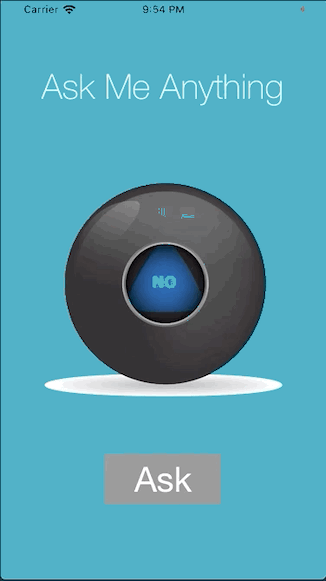

#  Magic 8 Ball

## Outline

This app makes me learn about some core programming concepts for the foundation of most of the apps I'll build in the future. This includes learning importants programming knowledge and building a neat one.

## What is Magic 8 Ball

This Magic 8 Ball app is a simple decision maker app. This app simply gives random answer when we press `Ask` button.

## What I've learnt

* Create an app with behaviour and functionality.
* Create links between the Interface Builder files and code using IBActions and IBOutlets.
* Get familiar with the Xcode code editor.
*  * Learn to use comments to annotate code.
* Understand and use Swift constants and variables.
* Understand and use collection types such as Swift arrays.
* Test and debug my app with the Xcode console.
* Learn about randomisation and how to generate random numbers in Swift.

## Demo

